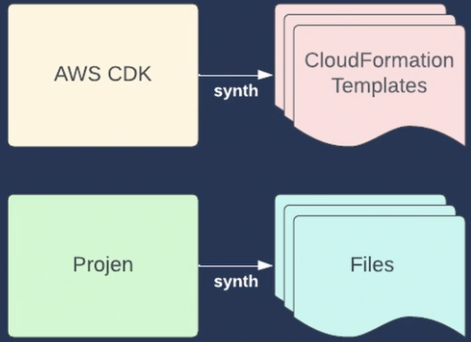

# Apps
### Project Structure
```
/src
├── main.ts
├── constructs
│   ├── MediaTranscoder
│   │   ├── MediaTranscoder.ts
│   │   ├── MediaTranscoder.lambda.ts
│   ├── backend
│   │   ├── Database.ts
│   │   ├── Api.ts
│   └── frontend
│       └── Website.ts
├── stacks
│   ├── VpsStack.ts
│   ├── backend
│   │   ├── ApiStack.ts
│   │   ├── RdsStack.ts
│   └── frontend
│       └── WebsiteStack.ts
└── stages
    └── AppStack.ts
```

##### Do's
 - 1+ files - put in their own directory
 - Every file contains one app/stack/construct
 - Interfaces for props should be in the same file as the class
 - File name should match class name.
```ts
// src/constructs/MediaTranscodingTrigger.ts
export interface MediaTranscodingTriggerProps {
}

export class MediaTranscodingTrigger extends Construct {
    constructor(scope: Construct, id: string, props: MediaTranscodingTriggerProps) {
        super(scope, id);
        // ...
    }
}
```

##### Don'ts
 - Don't have directories with more them 5 files in them

### Projen

```shell
projen new awscdk-app-ts                # AWS CDK app in TypeScript.
cdk init app --language typescript ./   # cdk equivalent to projen
```
```typescript
// .projenrc.ts
const project = new awscdk.AwsCdkTypeScriptApp({
    cdkVersion: '2.79.0',
    defaultReleaseBranch: 'main',
    name: 'advanced-aws-cdk',
    projenicTs: true,
    deps: [
        '@matthewbonig/state-machine'
    ]
});
```
```typescript
// .projenrc.ts
const pnpmProject = new awscdk.AwsCdkTypeScriptApp({
    // ...
    packageManager: NodePackageManager.PNPM,
});
// OR
const npmProject = new awscdk.AwsCdkTypeScriptApp({
    // ...
    packageManager: NodePackageManager.NPM,
});
```